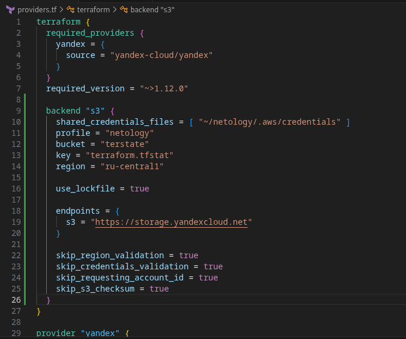
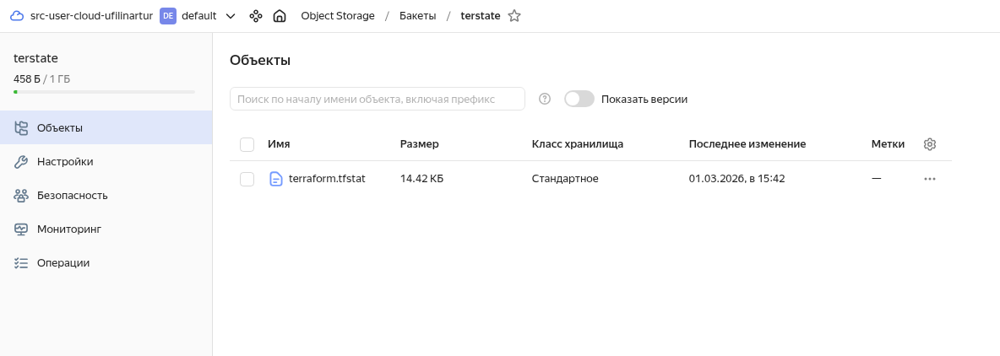
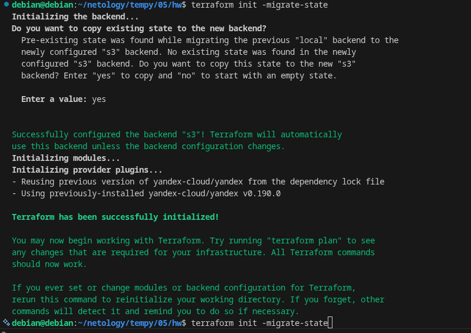

# ter-homeworks-05
  
## Задание 1
  
> Вывод использлвания утилиты tFlint

Ошибки найденные tflint(без дублей)

debian@debian:~/netology/tempy/04/src$ docker run --rm -v "$(pwd):/tflint" ghcr.io/terraform-linters/tflint --chdir=/tflint
4 issue(s) found:

../tflint/providers.tf:3:14: Warning - Missing version constraint for provider "yandex" in `required_providers` (terraform_required_providers)
../tflint/variables.tf:36:1: Warning - variable "vms_ssh_root_key" is declared but not used (terraform_unused_declarations)

> Вывод использлвания утилиты checkov
  
## Задание 2
  
> Настройка s3, помимо неё ещё есть добавление кредов, но там нет особой настройки, просто доавление ключей

  

> Миграция в s3

  

  

> Commit to GIT()
  
https://github.com/ufilin/ter-homeworks-04.git  
  
