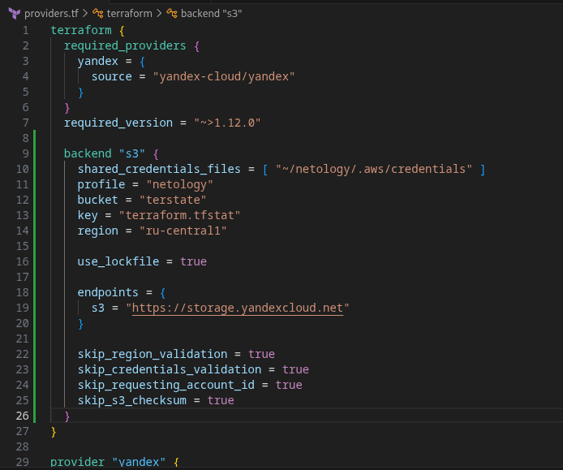
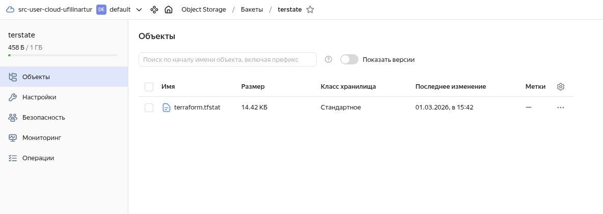
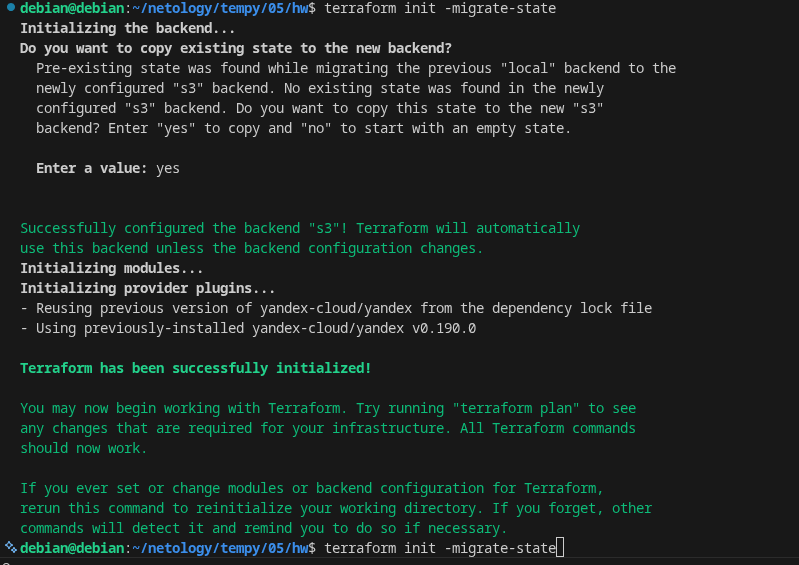
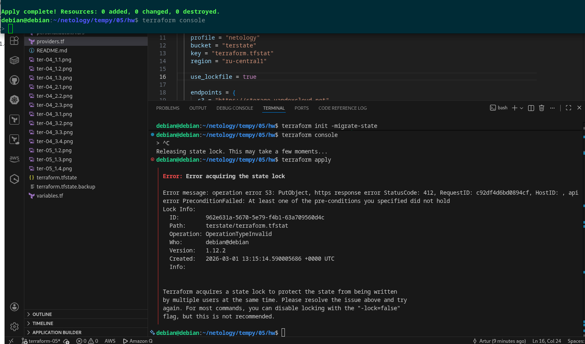
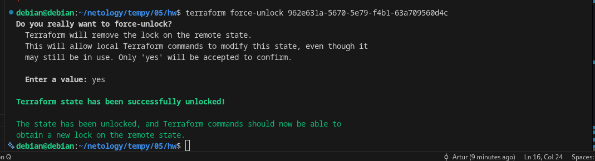

# ter-homeworks-05
  
## Задание 1
  
> Вывод использлвания утилиты tFlint  
  
Ошибки найденные tflint(без дублей)  
  
debian@debian:~/netology/tempy/04/src$ docker run --rm -v "$(pwd):/tflint" ghcr.io/terraform-linters/tflint --chdir=/tflint  
4 issue(s) found:  
  
../tflint/providers.tf:3:14: Warning - Missing version constraint for provider "yandex" in `required_providers` (terraform_required_providers)  
../tflint/variables.tf:36:1: Warning - variable "vms_ssh_root_key" is declared but not used (terraform_unused_declarations)  
  
> Вывод использлвания утилиты checkov(в этой папке почему то не получается использовать, в другой папке из задания Задания 3 всё работает...)  
> Использовал утилиту tfsec с дополнительно сгенерированным файлом yaml, для проверки yacloud иначе софт не видит проблем.  
  
> В основном в файлах ошибки не нашёл только в папке demonstration1/vms  
  
esults #1-3 HIGH Custom check failed for resource module.example-vm.yandex_compute_instance.vm[0]. Для публичных IP включите DDoS-защиту или используйте nat = false (3 similar results)
───────────────────────────────────────────────────────────────────────────────────────────────────────────────────────────────────────────────────────────────────────────────────────────────────────────────────
  git::https:/github.com/udjin10/yandex_compute_instance.git?ref=main/main.tf:25-74
   via main.tf:45-61 (module.example-vm)
───────────────────────────────────────────────────────────────────────────────────────────────────────────────────────────────────────────────────────────────────────────────────────────────────────────────────
   25  ┌ resource "yandex_compute_instance" "vm" {
   26  │   count = var.instance_count
   27  │ 
   28  │   name               = var.env_name == null ? "${var.instance_name}-${count.index}" : "${var.env_name}-${var.instance_name}-${count.index}"
   29  │   platform_id        = var.platform
   30  │   hostname           = var.env_name == null ? "${var.instance_name}-${count.index}" : "${var.env_name}-${var.instance_name}-${count.index}"
   31  │   zone               = element(var.subnet_zones, count.index)
   32  │   service_account_id = var.service_account_id
   33  └   description        = "${var.description} {{terraform yyy managed}}"
   ..  
───────────────────────────────────────────────────────────────────────────────────────────────────────────────────────────────────────────────────────────────────────────────────────────────────────────────────
  Individual Causes
  - git::https:/github.com/udjin10/yandex_compute_instance.git?ref=main/main.tf:22-43 (module.test-vm)
  - git::https:/github.com/udjin10/yandex_compute_instance.git?ref=main/main.tf:45-61 (module.example-vm)
  - git::https:/github.com/udjin10/yandex_compute_instance.git?ref=main/main.tf:22-43 (module.test-vm)
───────────────────────────────────────────────────────────────────────────────────────────────────────────────────────────────────────────────────────────────────────────────────────────────────────────────────
          ID custom-custom-yc003
      Impact ВМ без DDoS-защиты уязвимы для атак
  Resolution Включите DDoS-защиту или используйте только внутренние IP
  
  
  
## Задание 2
  
> Настройка s3, помимо неё ещё есть добавление кредов, но там нет особой настройки, просто доавление ключей

  

> Миграция в s3

  

  

> Commit to GIT()
  
https://github.com/ufilin/ter-homeworks-04.git  
  
> Ошибка доступа к state

  

> Снятие блокировки с state

  

## Задание 3

https://github.com/ufilin/ter-homeworks-04/pull/2

